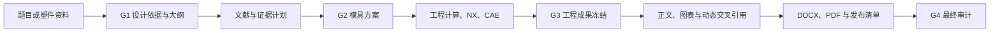

# Generate Injection Mold Thesis

面向本科注塑模具课程设计与毕业论文的可追溯 Codex Skill。它从论文题目或已提供的塑件资料出发，先建立塑件与模具工程项目，再以已冻结、可核验的工程证据生成论文内容；支持 Siemens NX/UG 建模与制图流程、Autodesk Moldflow 研究计划或真实求解证据、文献核验、Word 动态交叉引用和最终发布审计。

> 本仓库提供的是 Agent 工作流、项目模板和审计脚本，不包含 Siemens NX、Autodesk Moldflow、Microsoft Word 或任何第三方软件。使用者必须自行取得适用的合法授权。安装文件、界面可启动或命令入口可发现，都不等于许可证可用，也不等于仿真已经完成。

## 设计目标

普通论文生成容易出现“先写结论、后补数据”“图号与正文脱节”“仿真未执行却给出结果”等问题。本 Skill 将论文拆成可审计的工程证据链：



每个 Gate 都需要用户明确确认。上游输入发生变化时，最早受影响的 Gate 会重新打开，下游图纸、计算、仿真和正文必须同步更新。

## Agent 能力划分

| 能力域 | 主要工作 | 关键产物 |
| --- | --- | --- |
| 题目解析与从零设计 | 解析塑件、材料、机构与仿真目标；在无任务书、无学校模板、无二维/三维资料时提出原创教学概念 | 设计依据、塑件边界、需求与假设、三层论文大纲 |
| 塑件与材料工艺分析 | 分析壁厚、圆角、脱模斜度、筋/孔/卡扣、材料候选和成型窗口 | 参数台账、材料决策、工艺分析章节证据 |
| 注塑模具结构设计 | 比较分型、型腔数、浇注、排气、抽芯、顶出、冷却、模架和注塑机方案 | 方案矩阵、设计决策、装配逻辑、BOM |
| 工程计算 | 管理质量、注射量、锁模力、冷却、顶出及专题校核，检查单位、公式来源和裕量 | 参数表、计算书、独立复核记录 |
| NX/UG 建模与制图 | 探测 NX，使用 ASCII 临时盘符运行 NX Open Journal，保留原生模型、中性格式、图纸、日志、签名与校验和 | `.prt`、STEP/Parasolid、工程图、PDF、运行与打开验证记录 |
| Moldflow 研究与证据 | 探测 CLI，规划材料、网格、工况和验收指标；仅在真实成功求解后登记仿真值 | `.sdy`/相关原生文件、求解日志、结果提取、图表、SHA-256 |
| 文献与引用核验 | 以 CNKI 中文文献和标准、出版社、DOI/Crossref、材料/设备/软件官方资料为主要来源，记录检索与取舍 | 文献台账、主张台账、精确定位、证据文件 |
| 正文与交叉引用 | 按“先引出—再放置—后分析”组织图表公式，生成真实 Word 域 | `TOC`、`SEQ`、`REF/PAGEREF`、引用域、书签 |
| 一致性与发布审计 | 检查需求—参数—计算—图纸—CAE—正文—发布文件的一致性 | G1–G4 审计、DOCX 审计、PDF 页面检查、发布清单 |

## 真实性边界

Skill 使用以下来源标签区分数据性质：

- `USR`：用户提供；
- `SRC`：可核验来源；
- `DEC`：已批准的设计决策；
- `ASM`：已批准的假设；
- `CALC`：工程计算；
- `CAD`：真实 CAD 执行与测量；
- `SIM`：真实 CAE 求解结果；
- `OBS`：检查或观察记录。

只有在真实 NX 运行产生原生/中性文件、日志、校验和并通过打开验证后，才允许登记 `CAD` 数据。只有在合法可用的求解环境中成功完成 Moldflow 求解，并保留原生研究、工况、求解日志、结果文件和校验和后，才允许登记 `SIM` 数据。

当软件、模块或许可证不可用时，状态必须保持为 `prepared_unexecuted`。此时可以生成完整的材料选择、网格、工况、结果清单和执行计划，但不得编造填充时间、压力、锁模力、熔接痕、气穴、温度、收缩、翘曲、结果云图或“优化百分比”。

## G1–G4 工作流

### G1：设计依据与论文大纲

冻结项目分类、塑件边界、功能、使用环境、尺寸包络、材料候选、生产批量、设计目标、关键假设、交付物和三层论文大纲。题目从零设计时，项目被标记为 `EDU-CONCEPT`，所有尺寸与性能目标均是经用户确认的教学输入，不冒充企业或实测数据。

### G2：模具总体方案

至少比较两套完整方案，覆盖材料、型腔布局、分型面、浇口、排气、侧向抽芯、顶出、冷却、模架和注塑机。记录各方案的依据、影响、敏感性与淘汰理由，用户确认后冻结推荐方案。

### G3：工程数据、模型、图纸与仿真

完成参数与计算基线，生成或准备塑件模型、模具装配、零件图/装配图和 BOM。NX 与 Moldflow 的实际执行证据必须与模型版本一致；未执行项目只能以计划状态进入论文，并明确局限性。

### G4：论文与发布

依据冻结证据编写正文，最后完成摘要和结论。生成 DOCX/PDF 后刷新 Word 域，检查 PDF 页面、图表、公式和字体，生成含 SHA-256 的发布清单，再执行最终一致性审计。

## 项目目录

初始化后，每个论文项目使用独立目录：

```text
project/
├─ project.json                 # 项目状态、软件请求和 Gate
├─ approvals/                   # 用户确认原文与 Gate 证据
├─ 00_requirements/             # 设计依据、需求、假设和变更
├─ 01_outline/                  # 大纲与证据放置矩阵
├─ 02_sources/                  # 文献、主张、检索与证据清单
├─ 03_engineering/              # 参数、计算、决策和方案
├─ 04_cad/                      # NX 计划、模型、图纸、BOM 和导出
├─ 05_cae/                      # Moldflow 研究、工况、日志和结果
├─ 06_manuscript/               # 章节计划、正文和论文插图
├─ 07_audit/                    # 问题、PDF 页面检查和审计报告
└─ deliverables/                # DOCX、PDF、发布清单与交付文件
```

结构化字段、受控状态和稳定 ID 的完整定义见 [`references/project-schema.md`](references/project-schema.md)。

## 环境要求

- Codex 桌面版或支持 Skills 的 Codex 环境；
- Windows 10/11；
- Python 3.10 或更高版本；脚本仅使用 Python 标准库；
- 可选：合法授权且可运行的 Siemens NX/UG；
- 可选：合法授权且可求解的 Autodesk Moldflow Insight/Synergy；
- 最终生成并刷新 DOCX/PDF 时，需要 Microsoft Word 或兼容的文档处理环境。

没有 NX 或 Moldflow 仍可建立完整项目、完成手工工程设计与执行计划，但 Agent 会保留未执行状态，不会生成虚假软件结果。

## 安装

在 PowerShell 中将仓库克隆到 Codex Skills 目录：

```powershell
$Target = "$HOME\.codex\skills\generate-injection-mold-thesis"
git clone https://github.com/fly233li/generate-injection-mold-thesis.git $Target
```

如果目录已经存在，请先确认其中没有未保存的本地修改，再在该目录执行：

```powershell
git pull --ff-only
```

重新打开 Codex 任务或刷新 Skills 列表后，可用 `$generate-injection-mold-thesis` 显式触发。

## 快速开始

在 Codex 中可直接输入：

```text
使用 $generate-injection-mold-thesis，题目是“某塑件注塑模具设计与仿真优化”。
没有课程任务书、学校模板和塑件二维/三维资料，请从零设计。
```

Agent 会先输出 G1 设计依据与大纲供确认，不会越过 Gate 直接生成一篇缺乏证据的完整论文。

也可以手动调用初始化脚本：

```powershell
$SkillRoot = "$HOME\.codex\skills\generate-injection-mold-thesis"
$Python = "C:\Path\To\python.exe"

& $Python -B -X utf8 "$SkillRoot\scripts\init_project.py" `
  --title "某塑件注塑模具设计与仿真优化" `
  --root "C:\Path\To\Projects" `
  --mode from-zero `
  --cad nx `
  --cae moldflow
```

模板有意保持未完成状态：新项目在补齐真实设计依据、需求与假设前不会通过 G1。

## 主要脚本

| 脚本 | 用途 |
| --- | --- |
| `scripts/init_project.py` | 从模板初始化隔离的论文工程目录 |
| `scripts/register_record.py` | 以版本化、受控方式登记需求、假设、参数、决策、文献、主张和放置记录 |
| `scripts/project_state.py` | 查询状态、批准/重开 Gate、迁移快照 |
| `scripts/cad_probe.py` | 静态探测 NX 与 Moldflow；不启动求解器，不证明许可证 |
| `scripts/nx_stage_run.py` | 通过临时 ASCII 盘符运行项目内 NX Journal 并保留执行证据 |
| `scripts/nx_register_validation.py` | 校验并登记 NX 建模、制图、PDF 和重新打开验证结果 |
| `scripts/moldflow_probe.py` | 探测 Moldflow CLI 入口；`--verify-cli` 只验证帮助入口 |
| `scripts/moldflow_run.py` | 对已保存研究执行 dry-run 或真实求解，保留日志、结果和哈希 |
| `scripts/engineering_audit.py` | 审计单位、参数来源、假设和计算完整性 |
| `scripts/audit_project.py` | 执行 G1–G4 分阶段项目审计 |
| `scripts/docx_audit.py` | 检查 DOCX 的目录、编号、交叉引用、引用域、书签和遗留占位符 |

所有脚本都应使用同一个 Python 3.10+ 解释器，并通过带引号的绝对路径调用。不要依赖切换工作目录后仍能解析 `python` 或相对的 `scripts/`。

## Word 交叉引用

草稿阶段可使用 `{{cite:SRC-001}}` 与 `{{xref:FIG-001}}` 等追踪标记；它们不是最终 Word 域。生成 DOCX 时必须：

1. 使用标题样式和真实 `TOC` 域生成目录；
2. 使用 `SEQ` 域生成图、表、公式编号；
3. 为编号建立书签，并用 `REF`/`PAGEREF` 在正文引用；
4. 使用 Word 引用域或稳定的引用书签；
5. 刷新全部域、导出 PDF，再运行 DOCX 与页面审计。

每一项图、表、公式、图纸或 CAE 结果都要在 `evidence-placement.csv` 中绑定首次主张、章节、文件、来源/工件和 Word 字段。

## 本地验证

```powershell
$SkillRoot = "$HOME\.codex\skills\generate-injection-mold-thesis"
$Python = "C:\Path\To\python.exe"

& $Python -B -X utf8 -m unittest discover `
  -s "$SkillRoot\scripts\tests" `
  -p "test_*.py"
```

还可运行 Codex `skill-creator` 提供的结构校验：

```powershell
& $Python -B -X utf8 `
  "$HOME\.codex\skills\.system\skill-creator\scripts\quick_validate.py" `
  $SkillRoot
```

## 安全与合规

- 不绕过、不破解、不修改任何软件许可证机制；
- 不把会话密钥、账号令牌、许可证文件或个人凭据写入项目、日志和仓库；
- 软件和论文参考文献必须来自真实、可核验的合法来源；
- 概念设计仅用于教学，未经实物试制、模具调试和专业审核不得直接用于生产；
- Agent 负责建立证据链和发现不一致，不能替代导师审阅、工程签字或学校学术规范审查。

## 仓库结构

```text
generate-injection-mold-thesis/
├─ SKILL.md                     # Agent 的核心工作指令
├─ agents/openai.yaml           # Codex UI 元数据
├─ assets/                      # 项目模板、NX Journal 和本机路径配置模板
├─ references/                  # 分主题的工程、文献、CAD/CAE、DOCX 与发布规范
└─ scripts/                     # 初始化、登记、软件执行适配与审计工具
```

详细执行规则以 [`SKILL.md`](SKILL.md) 为准；本 README 用于帮助使用者理解、安装和测试，不替代 Skill 内的强制真实性边界与 Gate 规则。
